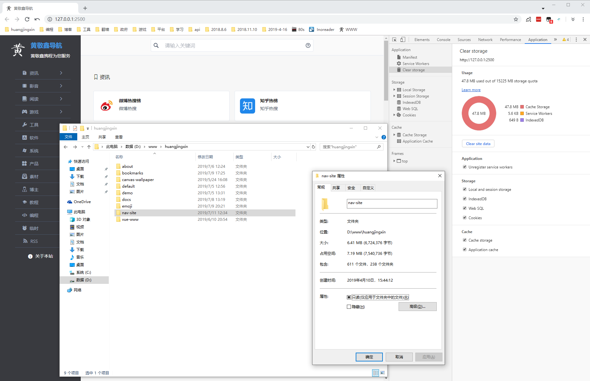

# 更新日志

> 由于兴趣制作了这个网址导航，希望把它打造成我最好的一个项目。

- 2019.4.12 - 整理制作，网站初建

- 2019.4.13 - 响应式

- 2019.4.15 - 大量收录网址，并更改了结构

- 2019.4.20 - PWA

- 2019.4.21 - 小屏三栏图标布局，并增加导航目录

- 2019.4.22 - 增加各大社交平台入口

- 2019.5.12 - 发现 Service Worker 不能更新

- 2019.6.12 - 增加搜索功能（不适用于手机）

- 2019.6.13 - 优化 PWA，无法解决（2019.5.12）更新问题

- 2019.7.11 - 发现如下问题

  

  问题描述：Cache 缓存（47.8M）大于文件（6.41M）总大小，Service Worker 有问题。

  BUG 复现：F5 刷新网页，Cache 会不断变大。第一次变成 9M 多，第二次直接变成 33M 多（翻倍递增）。

  解决办法：修改 sw.js 文件，优化&简化，完美修复，走你👉。

-----

# 自问自答

毋庸置疑，好的东西要经得住自己灵魂的检验😂。

## 为什么做导航？

这是我的互联网书签。随着我的见识增长，这个网站会不断完善。等到我变得离不开它的时候，我就会开始把它推荐给别人使用，其实它真心不错。**只有自己先喜欢，才能推荐给别人😜。**

## 为什么要使用 PWA？

网站有很多图片，会产生很多 HTTP 请求，每次访问都要重新请求，服务器压力很大。

两种常见解决方式（我选择后者）：

1. 精灵图

   由于精灵图需要拼接，而且使用起来不方便，就直接排除了。我需要一种能够随时变化的，并且很灵活的方式来调用这些图片。

2. Service Worker

   Service Worker 要结合 PWA 才能使用，把图片等资源保存在 Cache，然后劫持 fetch 请求，优先从本地访问资源，如果本地没有资源再从网络上下载使用，并保存到本地。

## 为什么使用本地 CDN？

- 开始想用 Vue CLI 来做，由于我不懂原理，没办法融合到 PWA 
- 后来使用免费跨域 CDN，发现不能存进 Service Worker
- 最后干脆把 CDN 存在本地，项目直接引入

## 为什么用 JSON 存数据？

开始的时候，我使用对象保存数据。在 Vue 的 data 中存一个对象，随着这个对象不断变大，我就把他分离出来，使用 ES6 模块化的方式引入。

后来发现，Node（module.exports / require）和 ES6（export / import）使用的模块化标准不一样，分离出来的对象文件不利于 Node 读取和保存。如果要把对象保存到文件，会变成 [Object Object]。

JSON 就不一样了，它存取都方便，转换也非常容易。

刷掘金社区时，有人说不要用 JSON 做配置文件，没办法写注释。我觉得呢，注释这种东西，还是作为点睛之笔，少写点好，点到即止。如果你有一个有趣的灵魂，能把注释写的生动形象有内涵，哪怕文字再多，我也很乐意看😊。

